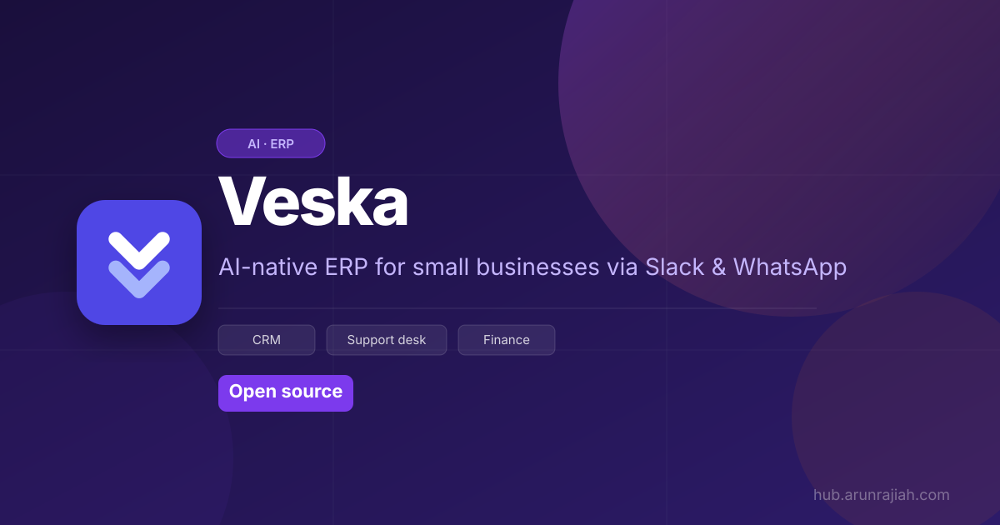
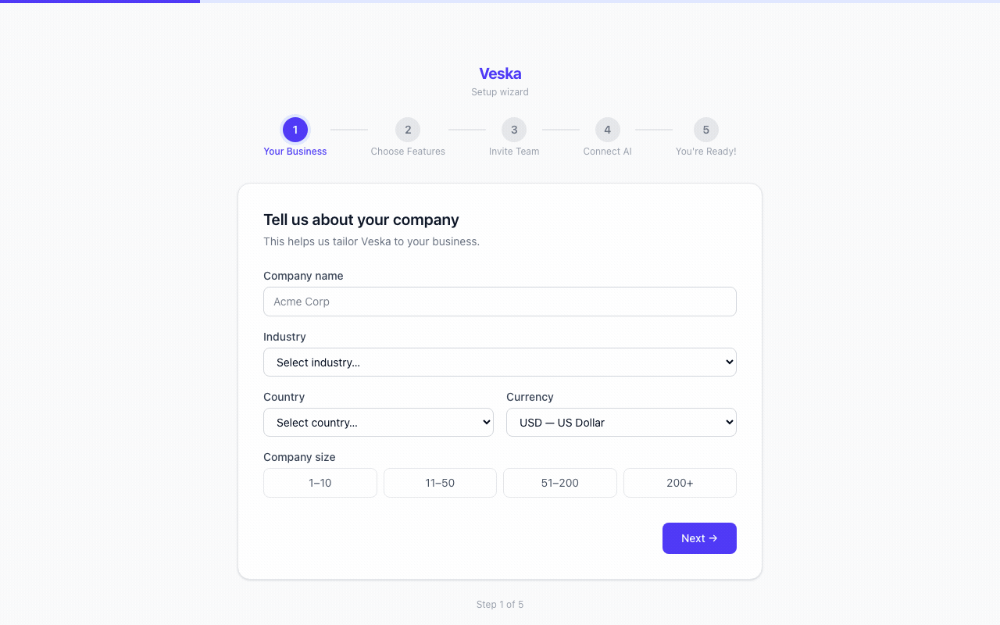
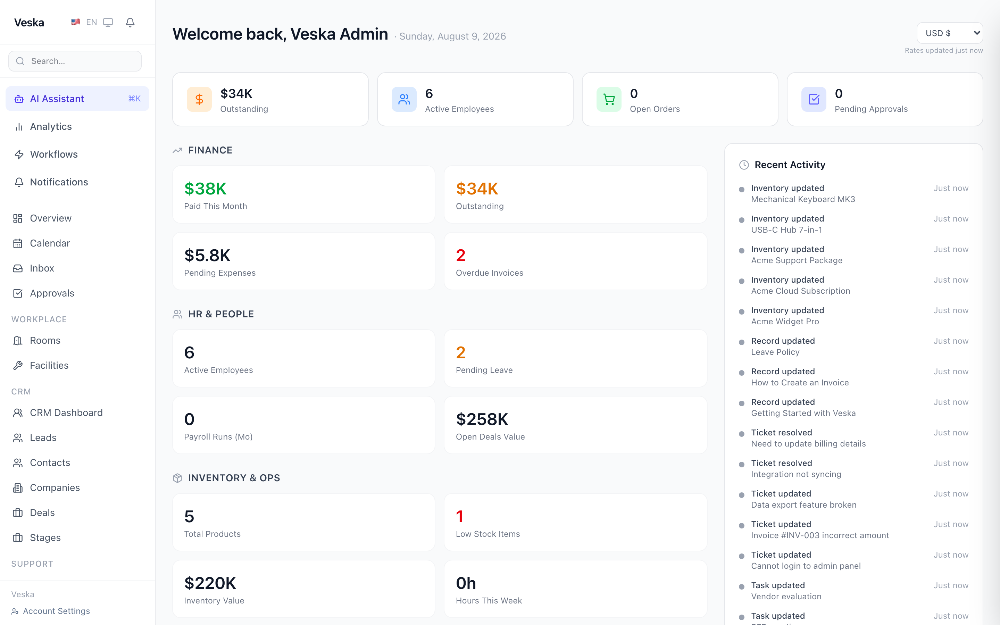
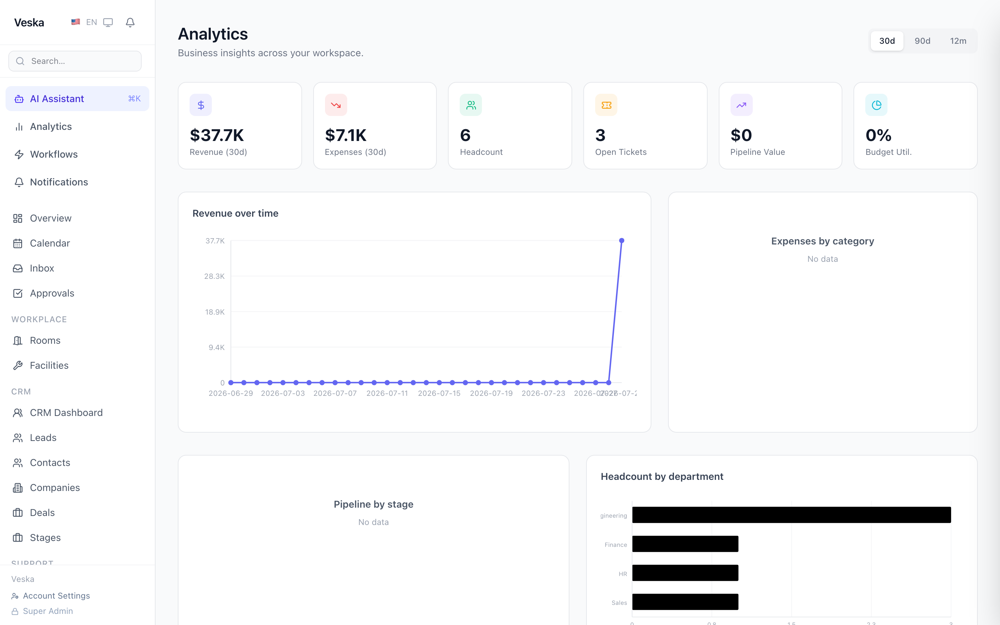
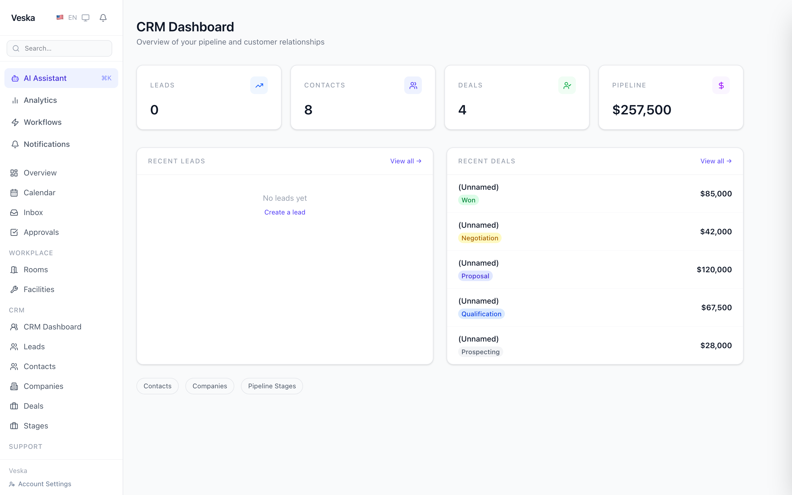
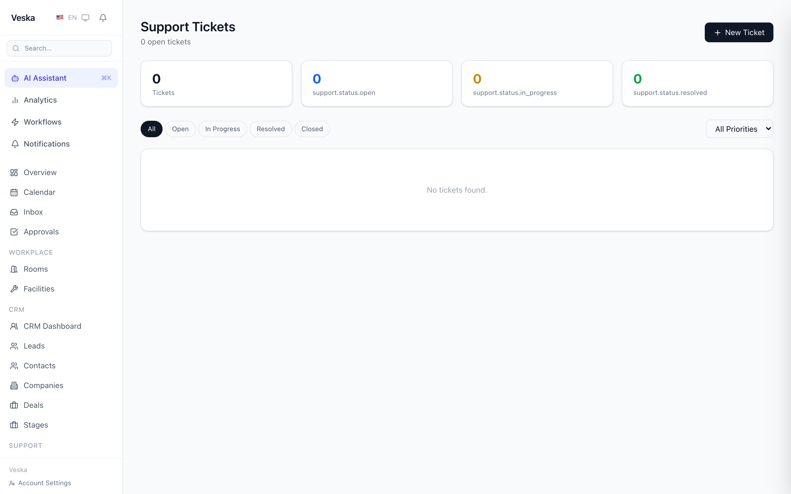
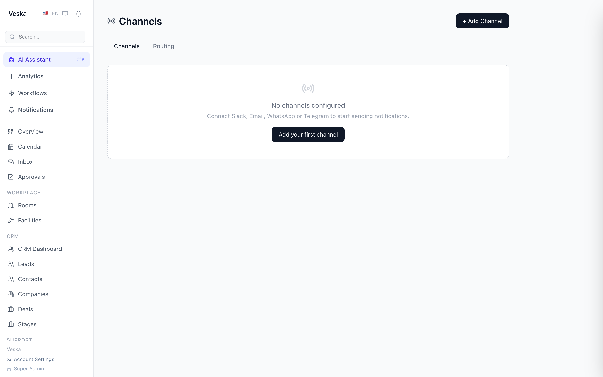
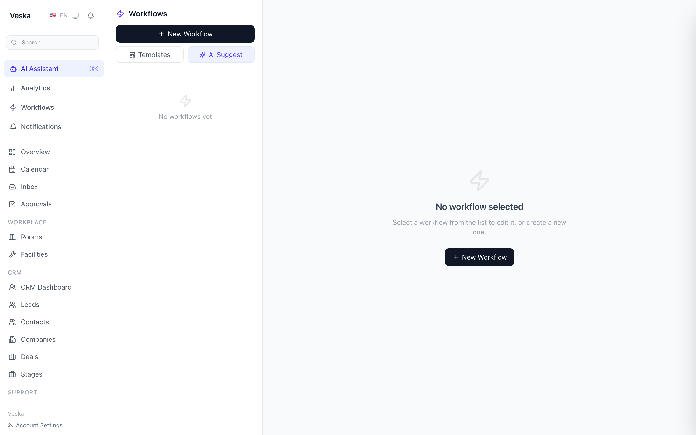
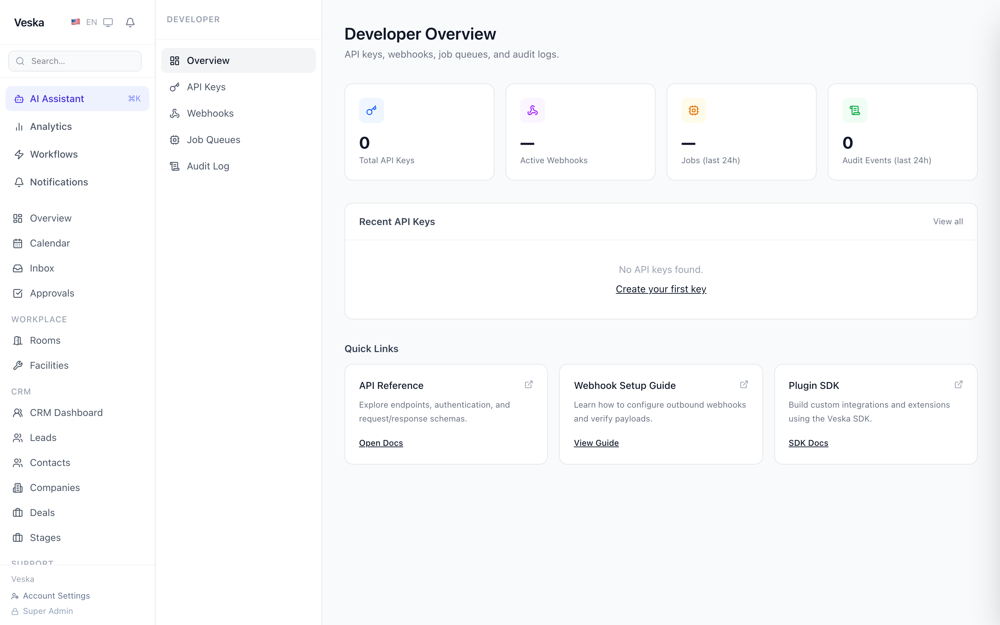
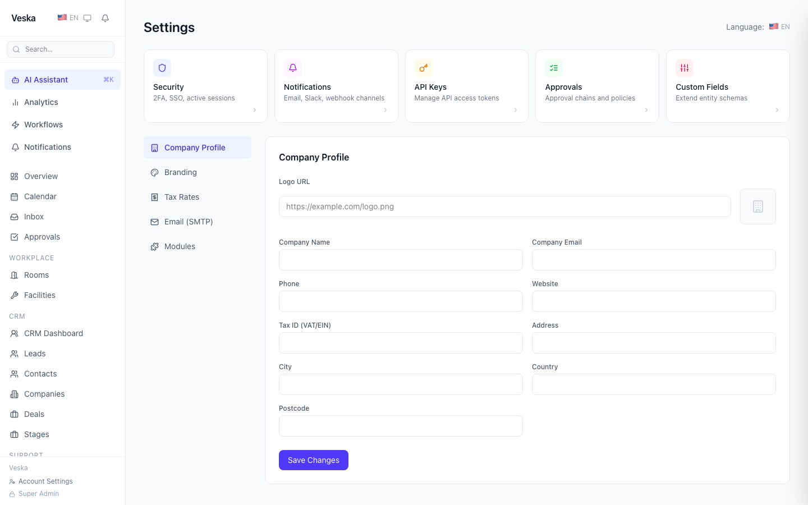

<p align="center">
  
</p>

<p align="center">
  
</p>

# Veska

**Self-hosted, AI-native operations platform for small and medium businesses.**

Describe your company in plain language. Veska sets up CRM, support desk, and finance in minutes. Your team works through Slack, WhatsApp, and Email — no accounts, no logins, no training required.

<p align="center">
  
</p>

[](https://github.com/arunrajiah/veska/actions/workflows/ci.yml)
[](LICENSE)
[](docker-compose.yml)
[](SELF_HOSTING.md)
[](CONTRIBUTING.md)
[](https://hub.arunrajiah.com/products/veska)

> Veska is **self-hosted and free** (Apache 2.0). A managed cloud edition is planned but not yet available — if you'd use one, [open a discussion](https://github.com/arunrajiah/veska/discussions) and tell us.

---

## The future of ERP is a conversation

<p align="center">
  
</p>

> *Type one sentence. Veska's AI configures your entire back office — CRM, support desk, finance, HR — and connects it to Slack, WhatsApp, and Email. Your team never needs to log in.*

Traditional ERP systems take months to implement, require consultants, and need constant training. Veska works the way your team already communicates:

| Old way | Veska way |
|---|---|
| Months of setup, IT consultants | Describe your business in plain English → live in minutes |
| Employees log into complex dashboards | Everything happens in Slack, WhatsApp, Email |
| Rigid workflows, expensive customisation | AI understands context and adapts automatically |
| $50K–$500K implementation cost | Free and open source — run it on your own server |

---

## Try it in 5 minutes

Spin up a complete demo company — contacts, a $258K open deal pipeline, invoices, expenses, support tickets — and click around:

```bash
# Prerequisites: Node.js 22+, pnpm 9+, Docker

git clone https://github.com/arunrajiah/veska.git
cd veska
cp .env.example .env          # works out of the box; add ANTHROPIC_API_KEY (or local Ollama) for AI features
pnpm install
docker compose up -d postgres redis   # Postgres 16 + Redis 7 only; pnpm dev serves the apps
pnpm db:migrate
pnpm seed                     # loads the "Acme Corp" demo company
pnpm dev
```

Then open the Admin UI and log in as the demo admin:

| | |
|---|---|
| Admin UI | http://localhost:3000 |
| Demo login | `admin@acme.com` / `demo1234` |
| API | http://localhost:3001 |
| Marketplace | http://localhost:3003 |

Other demo users: `finance@acme.com`, `hr@acme.com`, `john@acme.com` (same password) — each sees the app through a different role. Wipe the demo data anytime with `pnpm seed:clear`.

For production deployment, see **[SELF_HOSTING.md](SELF_HOSTING.md)**.

## What is Veska?

Veska is an open-source, AI-first ERP for small businesses. A founder describes their company and Veska configures the complete back office — CRM, support, finance — in under 20 minutes.

Once configured, almost nobody logs in. Employees, customers, and vendors interact with Veska through **Slack, WhatsApp, Email, and Telegram**. The AI does the work; humans just talk.

Under the hood it is not a thin wrapper around a chat model:

- **Real double-entry accounting** — an immutable ledger, invoices, expenses, budgets, recurring billing
- **An AI action agent with 57 ERP tools** — create invoices, approve expenses, search contacts, forecast revenue — every action audit-logged with the AI's reasoning trace
- **Multi-tenant by design** — tenant isolation enforced at the database layer, capability-based RBAC, TOTP 2FA
- **A workflow engine** — triggers on any entity event, with approvals routed to Slack/Email
- **A plugin SDK** — Stripe, QuickBooks, Shopify, Xero, and Google Calendar plugins ship in-repo

## Screenshots

<table>
  <tr>
    <td></td>
    <td></td>
  </tr>
  <tr>
    <td align="center"><em>Dashboard — live KPIs across finance, HR &amp; ops</em></td>
    <td align="center"><em>Analytics — revenue chart, pipeline, headcount by dept</em></td>
  </tr>
  <tr>
    <td></td>
    <td></td>
  </tr>
  <tr>
    <td align="center"><em>CRM — contacts, deals pipeline &amp; $258K in open deals</em></td>
    <td align="center"><em>Support — ticket inbox with channel badges &amp; thread view</em></td>
  </tr>
  <tr>
    <td></td>
    <td></td>
  </tr>
  <tr>
    <td align="center"><em>Channels — connect Slack, Email, WhatsApp &amp; Telegram</em></td>
    <td align="center"><em>Workflows — AI-powered automation builder</em></td>
  </tr>
  <tr>
    <td></td>
    <td></td>
  </tr>
  <tr>
    <td align="center"><em>Developer portal — API keys, webhooks &amp; job queues</em></td>
    <td align="center"><em>Settings — company profile, roles &amp; integrations</em></td>
  </tr>
</table>

## How is Veska different?

**Short version: Twenty is a CRM you log into. Odoo is an ERP you configure. Veska is a back office you talk to.**

| | Veska | Odoo / ERPNext | Twenty |
|---|---|---|---|
| Scope | CRM + support + finance + HR | Full ERP suite | CRM |
| Setup | Describe your business in plain English | Manual module configuration | Manual setup |
| Daily use | Slack / WhatsApp / Email — chat-first | Web dashboard | Web dashboard |
| AI | Agent with 57 ERP tools at the core | Add-ons | Assistive features |
| Stack | TypeScript end-to-end | Python | TypeScript |
| Maturity | Early (v0.x) — honest about it | Very mature | Mature |

If you need a battle-tested system today, Odoo or ERPNext are great choices. If you want to help build what comes after the dashboard, you're in the right place.

## Architecture

```
apps/
  api/          Hono API server (Node.js 22)
  admin/        Admin UI (Next.js 15)
  marketplace/  Plugin marketplace (Next.js 15)

packages/
  core/         Primitive layer: entities, workflows, permissions, channels, ledger
  sdk/          Plugin SDK (@veska/sdk)
  ui/           Shared UI components (shadcn/ui)
  cli/          Developer CLI (veska create-plugin, veska dev)

plugins/
  official/     Official first-party plugins (Stripe, QuickBooks, Shopify, Xero, Google Calendar)
```

**Stack:** TypeScript · Hono · PostgreSQL 16 + pgvector · Drizzle ORM · BullMQ · Redis · Next.js 15 · Anthropic Claude (or local Ollama)

See [ARCHITECTURE.md](ARCHITECTURE.md) for the full design.

## Docker

Run the full stack (Postgres, Redis, API, Admin UI, marketplace, marketing) with a single command:

```bash
cp .env.example .env
docker compose up --build
```

This is an alternative to the quickstart above, not an addition to it: it builds every app from source (several minutes on a first run) and binds the same ports, so don't run it alongside `pnpm dev`. For day-to-day development, start only the databases (`docker compose up -d postgres redis`) and run the apps with `pnpm dev`.

The compose file uses `develop.watch` for live reload during development — run `docker compose up --watch` to enable it.

**Individual image builds** — every service is a target in the single root `Dockerfile`, so dependencies are installed and compiled once and shared across all four:

```bash
docker build --target api         -t veska-api         .
docker build --target admin       -t veska-admin       .
docker build --target marketing   -t veska-marketing   .
docker build --target marketplace -t veska-marketplace .
```

## Build a plugin

```bash
npx @veska/cli create-plugin my-plugin
cd my-plugin && pnpm install && pnpm dev
```

SDK source and reference: [packages/sdk](packages/sdk). The official plugins in [plugins/official](plugins/official) are the best working examples: [Stripe](plugins/official/stripe) and [Shopify](plugins/official/shopify) show inbound webhook sync, [QuickBooks](plugins/official/quickbooks) and [Xero](plugins/official/xero) show outbound API sync.

**Want to see Veska talk to a tool you use?** Plugins are the easiest and most valuable way to contribute. Every plugin is a small folder (`manifest.json`, `package.json`, `src/index.ts`) that maps events to Veska entities through a sandboxed context, so you never touch the database directly. HubSpot, Salesforce, Notion, Slack workflows, Shopify fulfilment, WooCommerce, Zoho, Freshdesk, PayPal, Wise, Mailchimp: all fair game and all wanted. Open a [discussion](https://github.com/arunrajiah/veska/discussions) with your idea, or read the [plugin contribution guide](CONTRIBUTING.md#contributing-a-plugin) and open a PR. Good plugins get promoted to the official set.

## Roadmap

See [ROADMAP.md](ROADMAP.md) for what's planned. Highlights: hardening the WhatsApp and Telegram adapters, one-click deploy templates, a hosted demo instance, and a managed cloud edition.

## Contributing

Veska is young and contributions genuinely shape it. Start with issues labeled [`good first issue`](https://github.com/arunrajiah/veska/issues?q=is%3Aissue+is%3Aopen+label%3A%22good+first+issue%22), read [CONTRIBUTING.md](CONTRIBUTING.md) before opening a PR, and bring questions to [GitHub Discussions](https://github.com/arunrajiah/veska/discussions).

## License

Apache 2.0 — see [LICENSE](LICENSE).

The "Veska" name and logo are trademarks of the Veska project. Forks offering a competing hosted service must rebrand.
