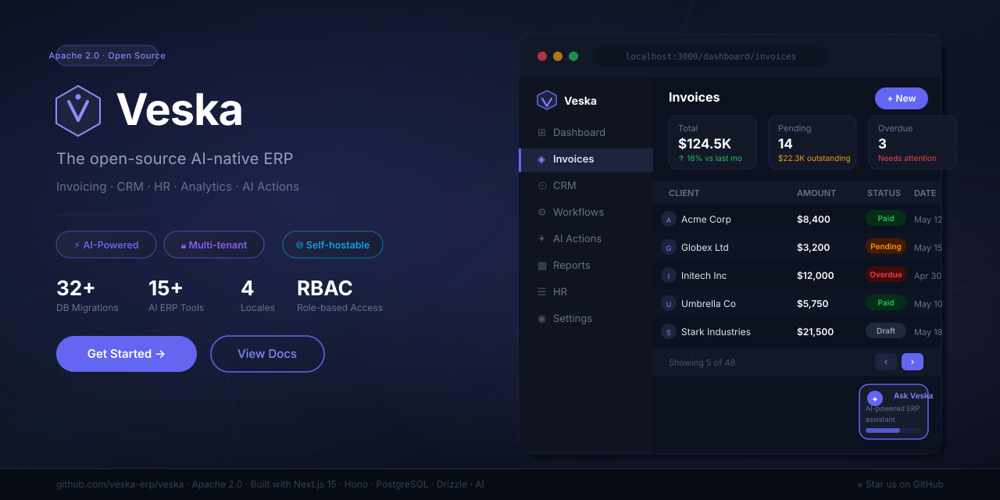
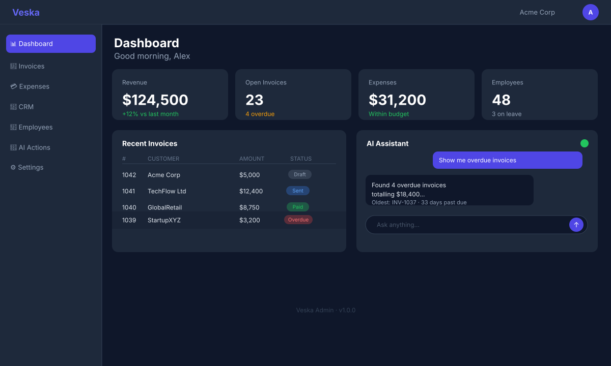
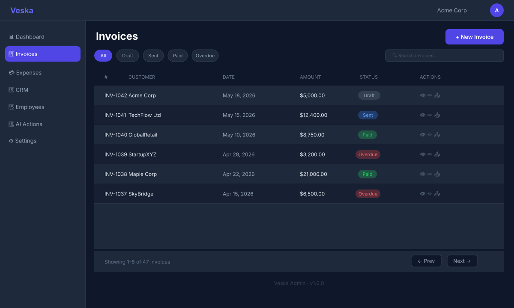

# Veska

**Self-hosted, AI-native operations platform for small and medium businesses.**

Describe your company in plain language. Veska sets up CRM, support desk, and finance in minutes. Your team works through Slack, WhatsApp, and Email — no accounts, no logins, no training required.

<p align="center">
  
</p>

[](https://github.com/arunrajiah/veska/actions/workflows/ci.yml)
[](LICENSE)

> **Looking for a hosted version?** Veska Cloud is a fully managed deployment at [veska.com](https://veska.com) — no servers to run, automatic updates, 99.9% SLAs. This repository is the self-hosted edition.

---

## What is Veska?

Veska is an open-source, AI-first ERP for small businesses. A founder describes their company and Veska configures the complete back office — CRM, support, finance — in under 20 minutes.

Once configured, almost nobody logs in. Employees, customers, and vendors interact with Veska through **Slack, WhatsApp, Email, and Telegram**. The AI does the work; humans just talk.

## Screenshots

<table>
  <tr>
    <td></td>
    <td></td>
  </tr>
  <tr>
    <td align="center"><em>Dashboard — KPIs, recent activity, AI assistant</em></td>
    <td align="center"><em>AI Actions — plain-language ERP commands</em></td>
  </tr>
  <tr>
    <td></td>
    <td></td>
  </tr>
  <tr>
    <td align="center"><em>Invoices — full lifecycle with approval gate</em></td>
    <td align="center"><em>Reports — visual builder with AI narrative</em></td>
  </tr>
</table>

## Self-hosted vs. Veska Cloud

| | Self-hosted (this repo) | [Veska Cloud](https://veska.com) |
|---|---|---|
| License | Apache 2.0 | Proprietary |
| Hosting | Your infrastructure | Managed by Veska |
| Setup | `docker compose up` | Sign up and go |
| Updates | Manual | Automatic |
| Support | Community (GitHub) | Email + SLA |
| Price | Free | Paid plans |

Both run the same core engine. The Cloud edition adds managed provisioning, automatic backups, and a support SLA — it does not have different features or a different codebase.

## Architecture

```
apps/
  api/          Hono API server (Node.js 22)
  admin/        Admin UI (Next.js 15)
  marketplace/  Plugin marketplace (Next.js 15)

packages/
  core/         Primitive layer: entities, workflows, permissions, channels, ledger
  sdk/          Plugin SDK (@veska/sdk)
  ui/           Shared UI components (shadcn/ui)
  cli/          Developer CLI (veska create-plugin, veska dev)

plugins/
  official/     Official first-party plugins (Stripe, QuickBooks, Shopify, …)
```

**Stack:** TypeScript · Hono · PostgreSQL 16 + pgvector · Drizzle ORM · BullMQ · Redis · Next.js 15 · Anthropic Claude

## Docker

Run the full stack (Postgres, Redis, API, Admin UI) with a single command:

```bash
cp .env.example .env          # fill in ANTHROPIC_API_KEY at minimum
docker compose up --build
```

| Service | URL |
|---|---|
| API | http://localhost:3001 |
| Admin UI | http://localhost:3000 |
| Marketing site | http://localhost:3002 |
| Marketplace | http://localhost:3003 |

The compose file uses `develop.watch` for live reload during development — run `docker compose up --watch` to enable it.

**Individual image builds** (from repo root, passing the full monorepo context):

```bash
docker build -f apps/api/Dockerfile         -t veska-api         .
docker build -f apps/admin/Dockerfile       -t veska-admin       .
docker build -f apps/marketing/Dockerfile   -t veska-marketing   .
docker build -f apps/marketplace/Dockerfile -t veska-marketplace .
```

## Quick start

See **[SELF_HOSTING.md](SELF_HOSTING.md)** for the full guide.

```bash
# Prerequisites: Node.js 22+, pnpm 9+, Docker

git clone https://github.com/arunrajiah/veska.git
cd veska
cp .env.example .env          # add your ANTHROPIC_API_KEY
pnpm install
docker compose up -d          # starts Postgres 16 + Redis 7
pnpm db:migrate
pnpm dev
```

| Service | URL |
|---|---|
| API | http://localhost:3001 |
| Admin UI | http://localhost:3000 |
| Marketplace | http://localhost:3003 |

## Build a plugin

```bash
npx @veska/cli create-plugin my-plugin
cd my-plugin && pnpm install && pnpm dev
```

Full SDK reference: [developers.veska.com](https://developers.veska.com)

## Contributing

Read [CONTRIBUTING.md](CONTRIBUTING.md) before opening a PR. Questions go in [GitHub Discussions](https://github.com/arunrajiah/veska/discussions).

## License

Apache 2.0 — see [LICENSE](LICENSE).

The "Veska" name and logo are trademarks of Veska, Inc. Forks offering a competing hosted service must rebrand.
